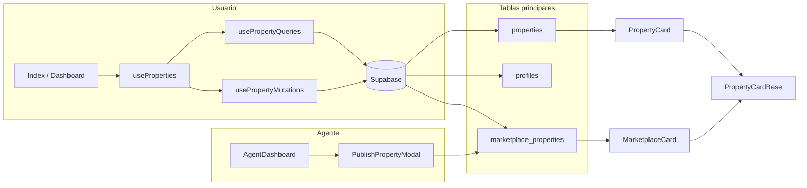
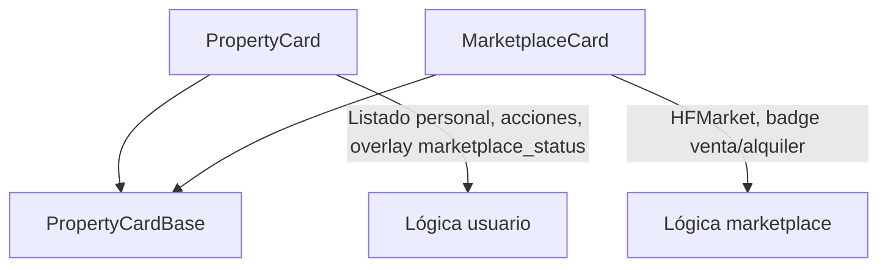
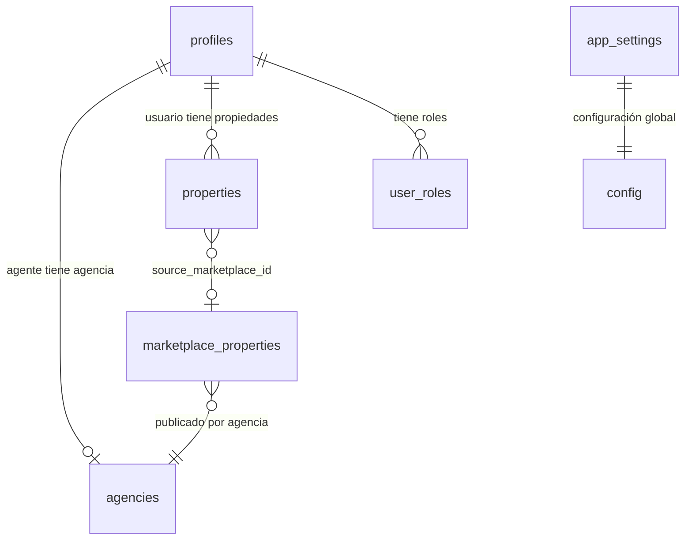

# 🏗️ Arquitectura — RemHomeFinder

Documentación de flujos y decisiones de arquitectura para el desarrollador del mañana. Los diagramas están en Mermaid y se pueden renderizar en GitHub, GitLab o cualquier visor compatible.

---

## 1. Flujo de autenticación y roles

El usuario se registra como **usuario normal** o **agencia/agente**. El estado que controla el acceso vive en `profiles.status`. Los agentes parten en `pending` hasta que un admin los aprueba desde `/admin/usuarios`.

```mermaid
flowchart TD
    subgraph registro [Registro]
        A[Usuario elige tipo cuenta] --> B{accountType}
        B -->|user| C[profiles.status = active]
        B -->|agency| D[profiles.status = pending]
    end
    subgraph postLogin [Después del login]
        C --> E[redirectByRole]
        D --> E
        E --> F{user_roles.role}
        F -->|admin| G[/admin]
        F -->|agency| H[/agency]
        F -->|user| I[/dashboard]
    end
    subgraph admin [Admin aprueba agente]
        J[Admin en /admin/usuarios] --> K[Cambia profiles.status a active]
        K --> L[Agente puede usar /agency]
    end
    D --> J
```

**Resumen para futuros movimientos:**

- **Source of truth del estado:** tabla `profiles`, columna `status` (`active` | `pending` | `suspended` | `rejected`). No usar `agencies.status` (fue eliminada).
- **Redirección:** lógica en `useAuth` → `redirectByRole(userId)` según `user_roles.role` (admin, agency, user).
- **Agentes nuevos:** quedan en `pending` hasta aprobación en panel admin.

---

## 2. Flujo de datos: propiedades y marketplace

Hay dos “mundos” de propiedades: el **listado personal** del usuario (tabla `properties`) y las **publicaciones del marketplace** (tabla `marketplace_properties`). Las tarjetas reutilizan un componente base visual (`PropertyCardBase`).



**Resumen para futuros movimientos:**

- **Listado personal:** lectura/escritura vía `useProperties` (fachada que usa `usePropertyQueries` y `usePropertyMutations`). Datos en `properties`.
- **Marketplace:** agentes publican en `marketplace_properties`. Los usuarios pueden guardar una publicación del marketplace en su listado (relación vía `source_marketplace_id`).
- **Estado del agente en el listado del usuario:** columna `properties.marketplace_status` (reservada, vendida, alquilada) para mostrar badges sin pisar el estado personal. Sincronización idealmente con trigger en BD (ver CHANGELOG).

---

## 3. Jerarquía de componentes de tarjetas

Misma base visual, dos contenedores con lógica distinta:



**Resumen para futuros movimientos:**

- **PropertyCard:** listado del usuario, cambios de estado, comentarios, overlay si la propiedad está reservada/vendida/alquilada en el marketplace.
- **MarketplaceCard:** solo lectura del marketplace, badge venta/alquiler.
- **PropertyCardBase:** UI compartida (imagen, precio, metros, etc.). Mantener reutilizable y sin lógica de negocio pesada.

---

## 4. Relación entre tablas principales (conceptual)



**Resumen para futuros movimientos:**

- **profiles:** usuario + estado (`status`). Un perfil puede ser agente y tener fila en `agencies`.
- **agencies:** datos de la agencia (sin columna `status`; el estado es solo en `profiles`).
- **properties:** listado personal; puede tener `marketplace_status` y `source_marketplace_id` si viene del marketplace.
- **marketplace_properties:** publicaciones de agentes (HFMarket).
- **user_roles:** determina si el usuario es admin, agency o user para redirección y permisos.

---

Para cambios concretos de schema, triggers pendientes y mapa de archivos, ver [CHANGELOG.md](CHANGELOG.md). Para poner el proyecto en marcha en tu máquina, [SETUP.md](SETUP.md).
